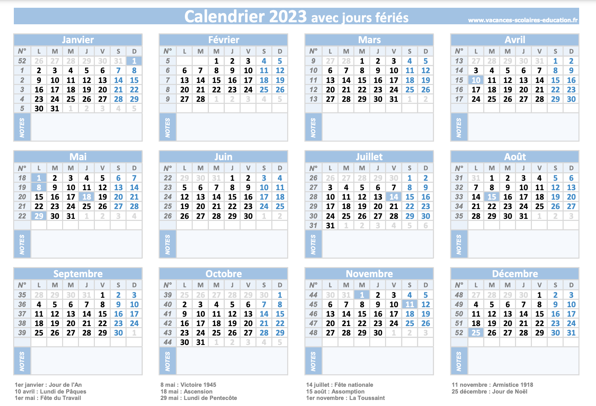

# 2.2.4 Vie quotidienne

• De l’**argent liquide ou une carte bleue** qui vous permettra de retirer de l’argent en
France (Vérifiez les accords entre les banques) et de régler vos premiers achats de
façon générale en attendant l’ouverture de votre compte bancaire français. Dans le cas
où vous n’avez pas de carte bleue avant votre arrivée, prévoyez de l’argent en espèces
(en euros de préférence)

• Votre **réservation de logement** imprimée (cf. chapitre)

• Les **documents demandés** pour l’entrée dans le logement (cf. chapitre)

• Votre **réservation de train imprimée** : dans le cas où votre destination finale est dans
une autre ville que Paris / région parisienne

• Votre **liste de contacts** (cf. partie sur les contacts)

• Un **téléphone portable** (en cas d’urgence) : activez l’option internationale si nécessaire

• Une **copie de votre attestation de virement irrévocable (AVI)** qui pourra servir pour justifier de la disponibilité de ressources financière le cas échéant

:::info
P.S : Il serait également judicieux de scanner tous ces documents et de les conserver dans votre boite mail. Cela vous sera d’une grande utilité si jamais il vous arrivait de perdre les originaux.
:::

Un autre point important de la vie quotidienne consiste à bien connaître les usages de la
société française. En effet, une intégration réussie a pour préalable la connaissance des us et
coutumes du pays d’accueil. De ce fait, ce chapitre contient une série d’indications concernant
les principaux jours fériés et leurs origines mais également les pratiques courantes les plus
notables de la société française.

## I. Calendrier

Vous trouverez ci-dessous le calendrier d’usage en France pour l’année 2023-2024. Celui-ci vous permettra d’identifier l’ensemble des jours fériés et des vacances scolaires.

**Source** : www.vacances-scolaires-education.fr/pdf/jours-feries/2023/calendrier-2023-avec-jours-feries.pdf

## II. Liste des jours fériés et leur origine

**Source** : www.jesuiscultive.com