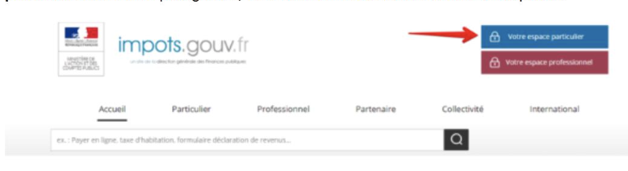
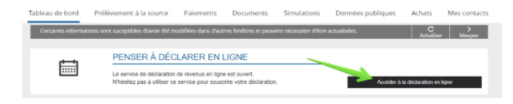
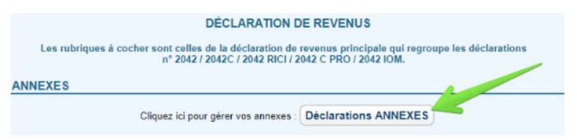
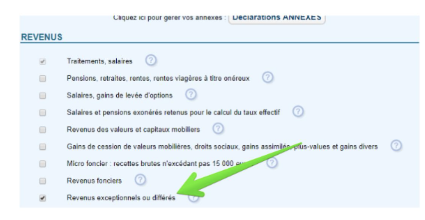

## Avant 2019

Autrefois, la déclaration d’impôt de l’année N-1 s’effectuait annuellement, sur une fiche imprimable remplie manuellement par soi-même. Ensuite elle était postée ou remise directement à la direction des finances publiques de son département

Grâce aux nouvelles réformes, depuis 2019, le contribuable ne devra plus lister l’ensemble des revenus perçus au courant de l’année précédente. Son impôt sur le revenu est automatiquement et directement prélevé sur le salaire mensuel de ce dernier et le montant déduit est présent sur la fiche de paie.

## Après 2019

Comme introduit ci-dessus, en 2019, le mot d'ordre c'est : la dématérialisation ; en d’autres termes la déclaration en ligne.

La déclaration des revenus sur internet est devenue obligatoire depuis le 1er janvier 2019, dès lors que :

- La résidence principale du contribuable est équipée d’un accès à Internet

- Le contribuable est en mesure de déclarer en ligne.

Néanmoins, une dérogation à cette règle est accordée aux personnes âgées, invalides, aux particuliers qui résident en zone blanche (sans couverture réseau) et aux primo déclarants qui n'ont pas reçu le courrier de l'administration fiscale avec leurs références (numéro fiscal, revenu fiscal de référence, référence de l'avis). Ceux-là conservent le droit de déclarer leurs revenus sur papier.

Pour déclarer vos revenus en ligne, vous devez vous connecter à votre espace personnel sur le site impots.gouv.fr, avec votre numéro fiscal et votre mot de passe :

Ensuite, il faut accéder à son espace pour renseigner ses informations personnelles.

Après avoir accéder à la déclaration en ligne, il faut vérifier les informations déjà préremplies et compléter le formulaire 2042 (Il s’agit de la déclaration principale) avec le complément d’informations ou modifier les informations en cas d’erreurs ;

Les revenus annexes concernent les autres formulaires. Ainsi, pour remplir ces formulaires, il faut sélectionner l’onglet déclarations annexes :

Concernant les déclarations des revenus exceptionnels :

Une fois complétée et envoyée, vous recevrez un accusé de réception de télédéclaration de revenus en PDF (disponible dans la section "Documents" de votre espace particulier sur le site des impôts). Votre déclaration sera mise en ligne au format PDF, consultable à tout moment mais surtout modifiable en ligne avant le délai, si vous constatez un oubli ou une erreur.